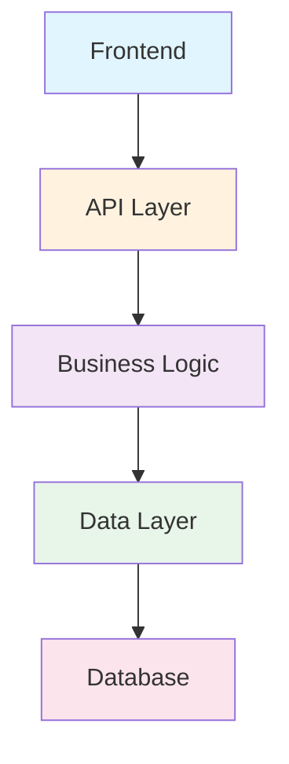
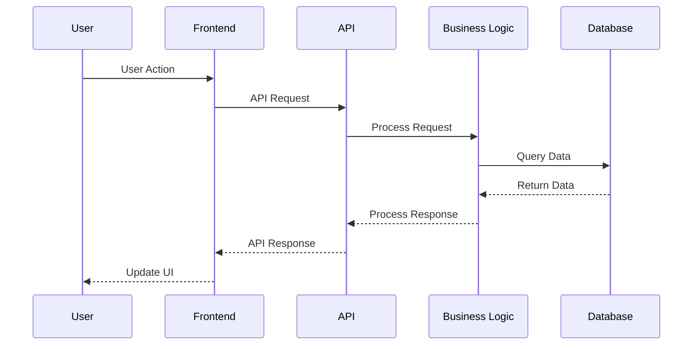

# Architecture Overview

## System Design

The project follows a modular architecture with clear separation of concerns.

## Component Diagram

## Key Components

### Frontend Layer
- User interface components
- State management
- API communication

### API Layer
- RESTful endpoints
- Authentication middleware
- Request validation

### Business Logic
- Core application logic
- Business rules
- Data transformation

### Data Layer
- Data access objects
- Query builders
- Caching mechanisms

## Technology Stack

- **Frontend**: React, TypeScript
- **Backend**: Node.js, Express
- **Database**: PostgreSQL
- **Cache**: Redis

## Architecture Principles

1. **Separation of Concerns**: Each layer has a specific responsibility
2. **Modularity**: Components are independently deployable
3. **Scalability**: Horizontal scaling supported at each layer
4. **Maintainability**: Clear interfaces and documentation

## Data Flow

## Related Pages

- [Core Features](page-3.md)
- [API Reference](page-4.md)
