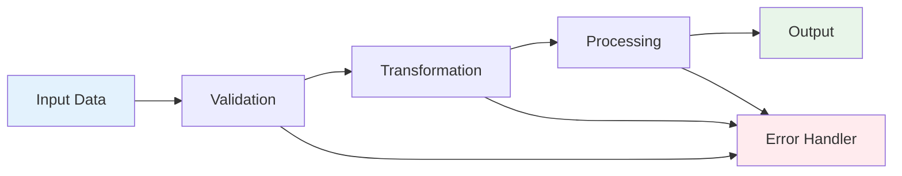
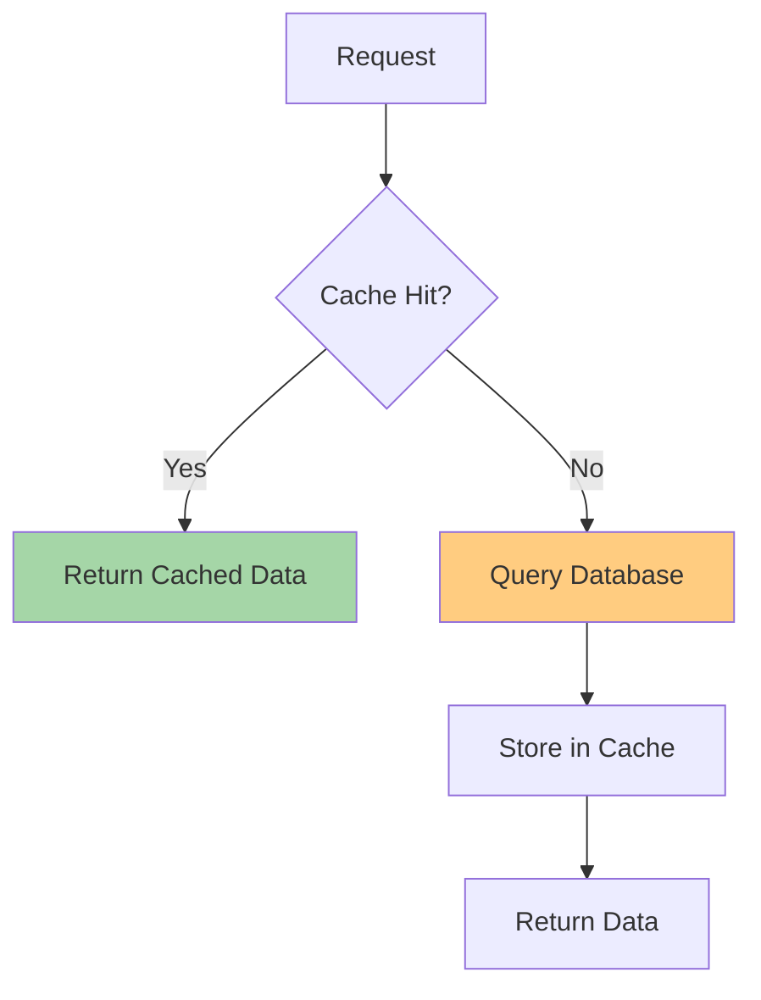

# Core Features

## Feature Overview

This project provides a comprehensive set of features for managing and processing data.

## Key Features

### 1. User Authentication

Secure authentication system with support for:
- JWT-based authentication
- OAuth 2.0 integration
- Multi-factor authentication (MFA)
- Session management

Example authentication flow:

```javascript
// Login example
const response = await fetch('/api/auth/login', {
  method: 'POST',
  headers: { 'Content-Type': 'application/json' },
  body: JSON.stringify({
    email: 'user@example.com',
    password: 'secure_password'
  })
});

const { token } = await response.json();
```

### 2. Data Processing Pipeline



Features:
- Real-time data processing
- Batch processing support
- Error handling and retry logic
- Data validation and sanitization

### 3. RESTful API

Complete REST API with:
- CRUD operations
- Filtering and pagination
- Rate limiting
- API versioning

```javascript
// Example API usage
const users = await fetch('/api/v1/users?page=1&limit=10', {
  headers: {
    'Authorization': `Bearer ${token}`
  }
});
```

### 4. Caching System

Multi-level caching strategy:



Benefits:
- Reduced database load
- Faster response times
- Configurable TTL (Time To Live)
- Cache invalidation strategies

### 5. Real-time Updates

WebSocket-based real-time communication:

```javascript
// WebSocket connection
const ws = new WebSocket('ws://localhost:3000');

ws.onmessage = (event) => {
  const data = JSON.parse(event.data);
  console.log('Received update:', data);
};
```

## Performance Metrics

| Feature | Response Time | Throughput |
|---------|--------------|------------|
| Authentication | < 100ms | 1000 req/s |
| Data Processing | < 500ms | 500 req/s |
| API Queries | < 200ms | 800 req/s |
| Real-time Updates | < 50ms | 2000 msg/s |

## Configuration

Features can be configured via environment variables:

```env
# Feature flags
ENABLE_CACHING=true
ENABLE_REALTIME=true
ENABLE_MFA=false

# Performance tuning
CACHE_TTL=3600
MAX_CONNECTIONS=100
RATE_LIMIT=1000
```

## Related Pages

- [Architecture Overview](page-1.md)
- [API Reference](page-4.md)
- [Getting Started](page-2.md)
